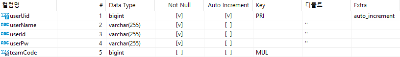
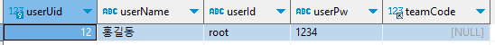

# Entity 구성
JPA를 사용하기 위해서는 Entity생성이 필수적이다. Entity란 자바객체와 테이블을 매핑해주는 객체라고 생각하면 된다. JPA를 사용하면 자바객체와 데이터베이스 테이블간의 매핑을 쉽게 처리할 수 있다.

Entity까지 생성 한 뒤 데이터베이스에 저장하는 것 까지 실습을 해볼겠다.

***
<br/>

아래 이미지는 데이터베이스에 생성된 User테이블과 작성한 User Entity 객체이다.




### 💡 Entity
```Java
package com.study.jpa.user.entity;

import com.study.jpa.team.entity.Team;

import jakarta.persistence.Column;
import jakarta.persistence.Entity;
import jakarta.persistence.FetchType;
import jakarta.persistence.GeneratedValue;
import jakarta.persistence.GenerationType;
import jakarta.persistence.Id;
import jakarta.persistence.JoinColumn;
import jakarta.persistence.ManyToOne;
import jakarta.persistence.Table;
import lombok.Getter;
import lombok.Setter;

@Entity
@Table(name = "user")
@Setter
@Getter
public class User {

    @Id
    @GeneratedValue(strategy = GenerationType.IDENTITY)
    private long userUid;

    @Column(nullable = false, name = "userName")
    private String userName;

    private String userId;

    private String userPw;

    @ManyToOne(fetch = FetchType.LAZY)
    @JoinColumn(name = "teamCode")
    private Team team;
}
```

    💡 User Entity의 필드 중 Team은 Entity 연관관계를 설명할 때 다룰 예정. 이번 파트에서는 일단 무시.


### 💡 Annotation
- `@Entity` : JPA entity 클래스임을 나타낸다.
- `@Table` : JPA entity 클래스와 데이터베이스 테이블 간의 매핑을 명시적으로 나타낸다. (name = "테이블 명")
- `@Id` : JPA entity 클래스의 기본 키를 나타낸다.
- `@GeneratedValue` : entity 클래스의 기본 키를 어떻게 생성할지 지정하는데 사용한다.
- `@Column` : entity필드를 테이블 컬럼에 매핑할때 사용한다. 주로 name과 nullable이 사용되지만, 필드명과 테이블 컬럼이 일치하다면 사용하지 않아도 무방하다.
- `@ManyToOne` : 연관 관계 매핑을 위해 사용하는 어노테이션이며, N:1 관계를 표시할 때 사용한다. 자세한 내용은 엔티티 연관관계에서 설명.
- `@JoinColumn` : 연관관계의 주인임을 나타내며, 외래 키를 지정한다. 자세한 내용은 엔티티 연관관계에서 설명.


### 💡 Repository
Repository는 데이터베이스와의 상호 작용을 추상화하고 단순화하는데 사용된다. JPA의 Repository 인터페이스는 일반적으로 아래와 같은 기능을 제공한다.
1. CRUD 작업 : `save()`, `findById()`, `findAll()`, `delete()` 등과 같은 기본적은 CRUD작업을 지원한다.
2. 쿼리 메소드 : 메소드의 이름에 따라 쿼리를 생성하고 실행할 수 있도록 지원한다.
3. 페이징 및 정렬 : 페이징 및 정렬과 관련된 메소드를 제공하여 대용량의 데이터를 처리할 수 있도록 한다.

아래 코드는 위의 UserEntity에 해당하는 UserRepository이다.
```Java
package com.study.jpa.user.repository;

import org.springframework.data.jpa.repository.JpaRepository;
import org.springframework.stereotype.Repository;

import com.study.jpa.user.entity.User;

@Repository
public interface UserRepository extends JpaRepository<User, Long> {
    // 별도의 메소드를 선언하지 않아도 JpaRepository에서 기본적인 save(), delete()등과 같은 기본적인 CRUD메소드 사용이 가능하다.
}
```
Repository의 생성은 JpaRepository를 상속받으며, 제네릭 타입으로는 Entity 타입(User)과 User Entity의 기본 키 타입(Long)을 받는다.

### 💡 Test Code
```Java
@SpringBootTest
class JpaApplicationTests {

    @Autowired UserRepository userRepository;
    
    @Test
    void saveTest() {
        User user = new User();
        user.setUserName("홍길동");
        user.setUserId("root");
        user.setUserPw("1234");
        userRepository.save(user);
    }
}
```

JPA의 save() 메소드를 사용하면 insert 또는 update가 가능한데, 위의 테스트 코드를 실행하면 아래와 같은 쿼리가 실행된다. save한 뒤에는 save한 데이터를 반환까지 해준다.

    Hibernate: insert into user (teamCode,userId,userName,userPw) values (?,?,?,?)
    Hibernate: select u1_0.userUid,u1_0.teamCode,u1_0.userId,u1_0.userName,u1_0.userPw from user u1_0 where u1_0.userUid=?

<br/>
    
    👍 참고 : JPA 메소드가 실행될 때 동작하는 쿼리를 보고 싶으면 application.yaml 파일의 spring.jpa.show-sql설정을 true로 두면 된다.
    
    


### 💡 Result

