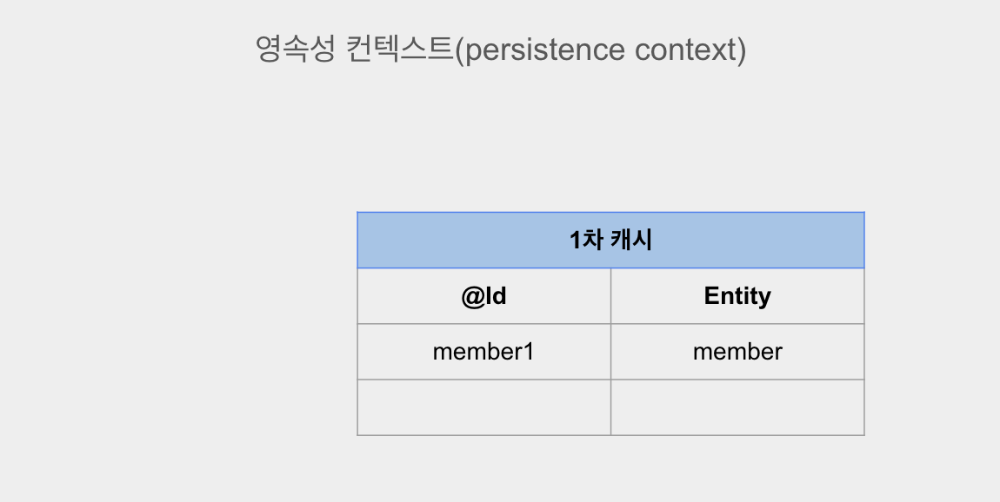
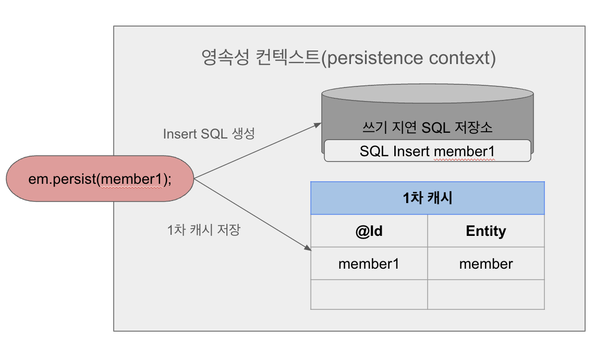
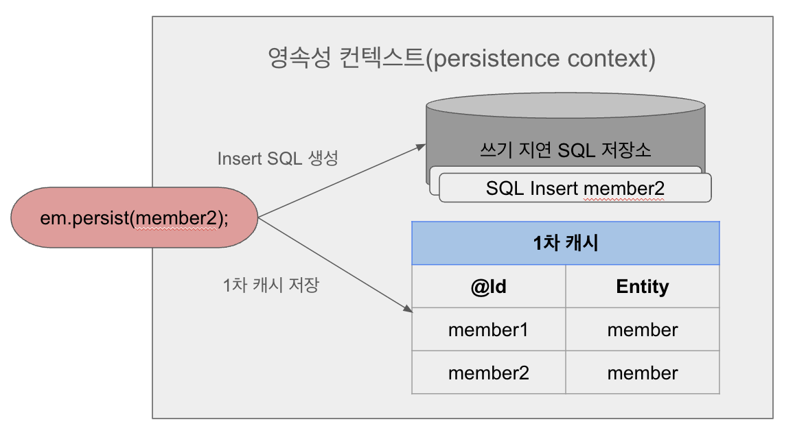
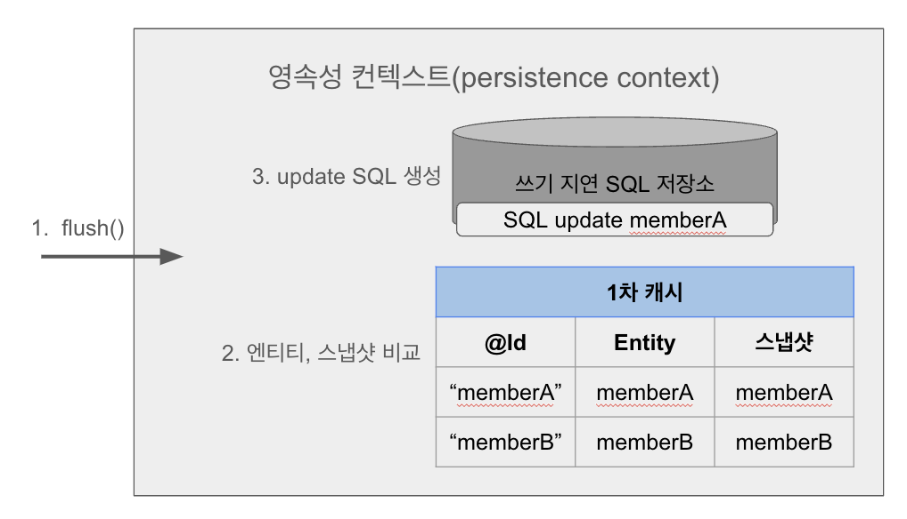

# 영속성
## 1. 엔티티 매니저 팩토리와 엔티티 매니저
엔티티 매니저는 엔티티를 저장, 수정, 삭제하는 등 엔티티와 관련된 모든 일을 처리하게 된다. 엔티티 매니저 팩토리란 방금 말한 엔티티 매니저를 생성하는 역활을 하게 된다.

#### 1) 엔티티 매니저 팩토리 생성
데이터베이스를 하나만 사용하는 서비스의 경우 엔티티 매니저 팩토리는 1개만 생성하게 된다.
```Java
EntityManagerFactory emf = Persistence.createEntityManagerFactory("jpatest");
```
위의 코드를 호출하면 저장된 jdbc정보를 바탕으로 엔티티 매니저 팩토리가 생성이 된다.

#### 2) 엔티티 매니저 생성
```Java
EntityManager em = emf.createEntityManager();
```

하나의 엔티티 매니저 팩토리는 여러 엔티티 매니저를 만들 수 있는데, 엔티티 매니저는 생성되더라고 데이터데이스 연결이 필요하기 전까지는 커넥션을 얻지 않는다. 

<br/>

## 2. 영속성 컨텍스트(persistence context)란?
영속성 컨텍스트란 엔티티들이 저장되는 공간이다. 엔티티 매니저로 엔티티를 저장하거나 조회하면 엔티티 메니저는 영속성 컨텍스트 안에 엔티티를 저장하고 관리한다.

```Java
em.persist(member);
```
member 엔티티를 저장한다고 많이 사용했던 위의 코드는 정확히 말하면 **엔티티 매니저가 영속성 컨텍스트에 member엔티티를 저장**한다는 의미이다.

#### 1) 엔티티의 생명주기
엔티티의 생명주기는 아래와 같이 4가지가 있다.
1. 영속 &rightarrow; 영속성 컨텍스트에 저장된 상태.
2. 비영속 &rightarrow; 영속성 컨텍스트와 관련이 없는 상태.
3. 준영속 &rightarrow; 영속성 컨텍스트에 저장되었다가 분리된 상태.
4. 삭제 &rightarrow; 영속성 컨텍스트에서 삭제된 상태.

#### 1-1) 영속
```Java
em.persist(member);
```
위의 코드는 엔티티 매니저를 통해 member엔티티가 영속성 컨텍스트에 저장된 상태이다. 그럼 member엔티티는 **영속**된 상태이다.

#### 1-2) 비영속
```Java
Member member = new Member();
member.setId("test");
member.setName("홍길동");
```
위의 코드는 member엔티티를 생성했지만 저장되지 않은 순수 객체의 상태이다. 지금 member엔티티는 **비영속**된 상태이다.

#### 1-3) 준영속
```Java
em.detch(member);
```
member 엔티티는 위의 코드로 인해 영속성 컨텍스트에서 분리된 **준영속**상태가 되었다. 
`em.close();`, `em.clear();` 처럼 영속성 컨텍스트를 닫아버리거나, 초기화를 해도 영속성 컨텍스트가 관리하던 영속 상태의 엔티티는 준영속 상태가 되어버린다. 

#### 1-4) 삭제
```Java
em.remove(member);
```
member 엔티티가 영속성 컨텍스트와 데이터베이스에서 **삭제**되었다.

<br/>

## 3. 영속성 컨텍스트에서의 엔티티 관리
영속성 컨텍스트는 엔티티를 `@Id`로 매핑한 값인 식별자로 구분한다. 따라서 **영속 상태에 있는 엔티티는 반드시 식별자를 가지게 된다.** 

영속성 컨텍스트에 있는 엔티티는 언제 데이터베이스에 저장이 될까? JPA는 보통 트랜잭션을 커밋하는 순간 영속성 컨텍스트에 저장된 엔티티를 데이터베이스에 저장하게 되는데 이를 플러시(flush())라고 한다.

#### 3-1) 엔티티 조회
영속성 컨텍스트 내부에는 영속 상태의 엔티티가 저장되는 캐시가 있다. 모든 영속 상태의 엔티티는 이 캐시에서 조회를 하게 되는데, 쉽게 이해하자면 영속성 컨텍스트 내부에는 캐시인 Map이 하나 존재하고 이 Map의 key는 `@Id`로 매핑한 필드값이고 value는 엔티티이다.

```Java
// member엔티티 생성
Member member = new Member();
member.setId("member1");
member.setName("홍길동1");

// member엔티티를 영속
em.persist(member);
```
위의 코드를 실행하게 되면 아래 그림과 같이 영속성 컨텍스트에 member엔티티를 저장하게 된다. **(아직 데이터베이스에 저장된 상태는 아니다.)**



이 상태에서 엔티티 매니저의 `find()` 메소드를 통해 엔티티를 조회할 수 있는데 1차 캐시에 저장된 엔티티를 조회해서 가져오게 된다. 만약 1차캐시에 엔티티가 없다면 데이터베이스에서 조회해서 1차캐시에 저장한 뒤 엔티티를 가져오게 된다.

#### 3-2) 엔티티 등록
```Java
// 엔티티 매니저 및 트랜잭션 생성
EntityManager em = emf.createEntityManager();
EntityTransaction transaction = em.getTransaction();

// 트랜잭션 시작
transaction.begin();

// member1, member2 엔티티 영속화
// 아직까지 디비에서 insert 쿼리 실행되지 않는다. 단지 영속성 컨텍스트에 영속화를 시키는 단계
em.persist(member1);
em.persist(member2);

// 트랜잭션 커밋
// 이때 디비에 insert쿼리가 날라간다.
transaction.commit();
```
엔티티 매니저는 트랜잭션을 커밋하기 직전까지 SQL쿼리를 SQL저장소에 저장해두었다가 트랜잭션이 커밋되는 순간 모아둔 쿼리를 데이터베이스로 보내서 실행한다.

이것을 **쓰기 지연(transactional write-behind)** 이라 한다.

각 member1 엔티티와 member2 엔티티가 영속화 될때 아래 그림과 같이 이루어진다.




#### 3-3) 엔티티 수정
SQL을 사용하면 수정 쿼리를 직접 작성해야한다. 하지만 프로젝트 규모가 점점 커지면서 수정 쿼리도 계속 추가되면서 예외 상황이 생기면 쿼리 추가도 이루어져야 하는 상황이 발생이 된다.

이런 개발 방식의 문제는 비즈니스 로직을 분석하기 위해 쿼리를 계속 확인해야되며, SQL에 의존적으로 비즈니스 로직을 개발해야 한다는 문제가 있다.

JPA에서 엔티티를 수정하는 방식은 아래와 같다.
```Java
EntityManager em = emf.createEntityManager();
EntityTransaction transaction = em.getTransaction();
transaction.begin(); // 트랜잭션 시작

// 영속 엔티티 조회
Member memberA = em.find("Member.class", "memberA");

// 영속 엔티티 수정
memberA.setUserName("newName");
memberA.setAge(20);

// 트랜잭션 커밋
transaction.commit();
```

위의 코드를 살펴보면 영속성 컨텍스트에서 영속 상태에 있는 엔티티만 조회하고 값만 변경해서 별도의 메소드 없이 바로 트랜잭션을 커밋하였다.

이렇게 엔티티의 변경사항을 데이터베이스에 자동으로 반영해주는 기능을 **변경 감지** 라고 한다.



**변경 감지** 기능은 위의 그림으로 설명이 가능하다. 일단 엔티티는 영속성 컨텍스트에 처음 들어올 때 복사본을 스냅샷이라는 이름으로 저장을 하게 된다.

그리고 엔티티의 변경은 아래의 순서를 따른다.
#### 1. 트랜잭션이 커밋하게 되면 엔티티 매니저 내부에서 flush()가 호출된다.
#### 2. 영속성 컨텍스트에서 수정된 엔티티와 최초 상태인 스냅샷 엔티티를 비교한다.
#### 3. 수정된 엔티티가 존재한다면 Update SQL을 생성해서 쓰기 지연 SQL저장소에 저장한다.
#### 4. 쓰기 지연 SQL 저장소에서 데이터베이스로 쿼리를 전달한다.

이렇듯 **변경 감지** 기능은 영속성 컨텍스트에 영속 상태로 존재하는 엔티티에 대해서만 활용이 가능하다.

그리고 생성되는 Update SQL은 변경된 컬럼에 대해서만 생성되지 않고 엔티티의 모든 필드를 대상으로 Update SQL이 생성된다.

    💡 참고
    변경된 필드만 동적으로 SQL을 생성하기 위해선 하이버네이트 확장 기능을 사용해야 한다. 

    @DynamicUpdate 어노테이션을 엔티티 클래스에 추가하여 사용이 가능하다.

        


